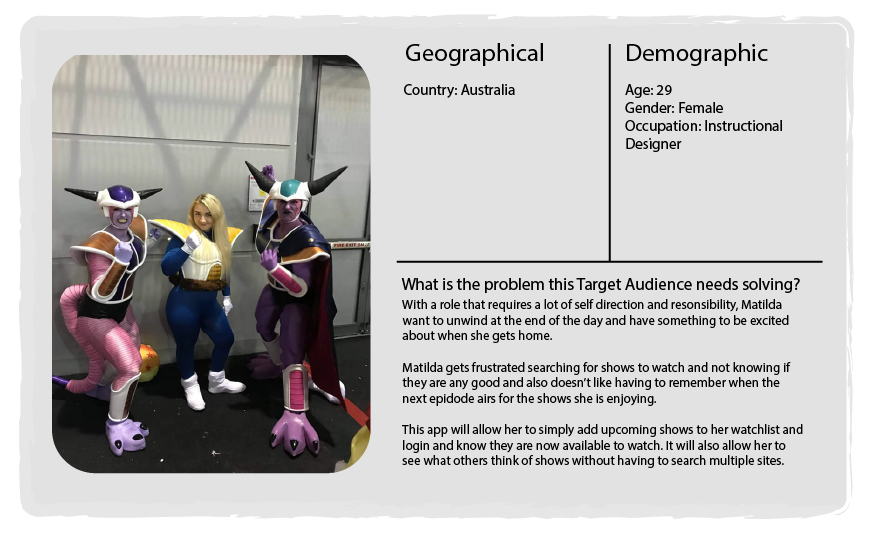
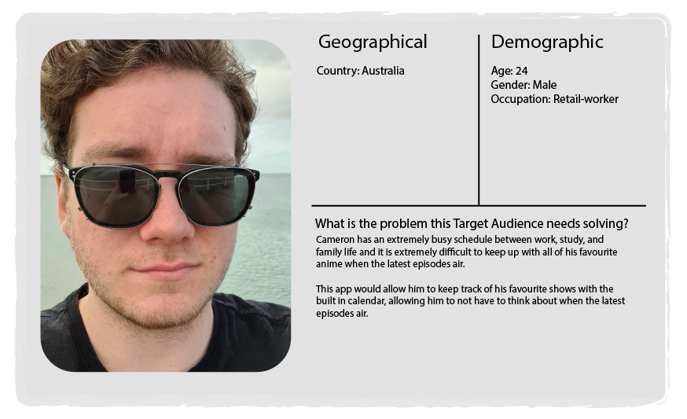
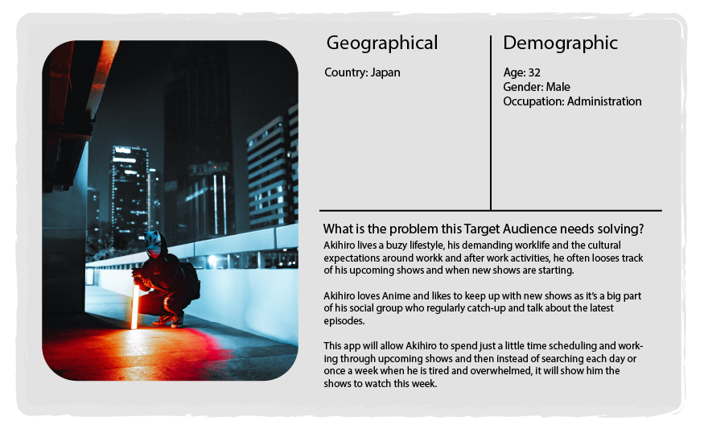
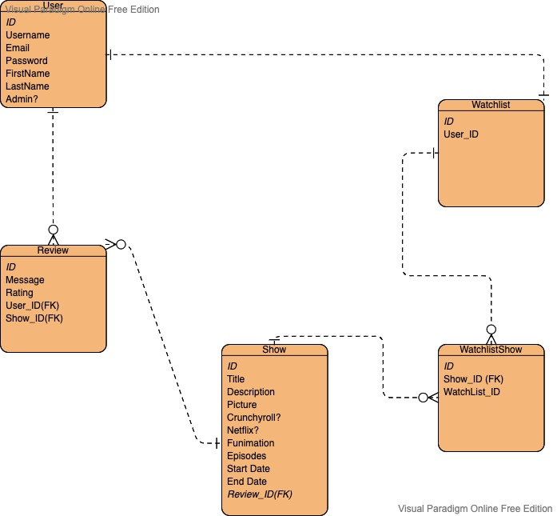
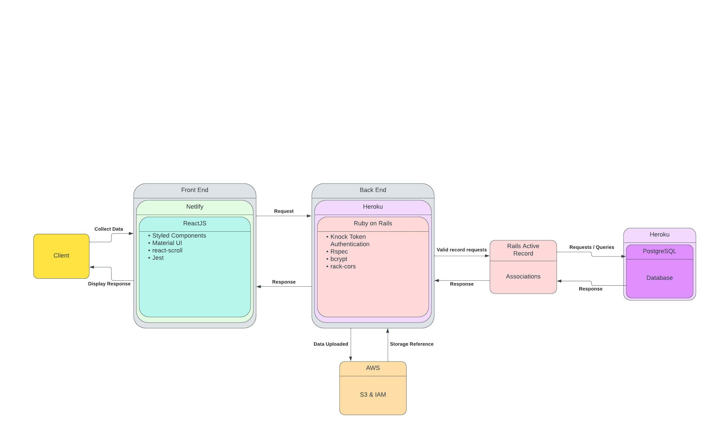
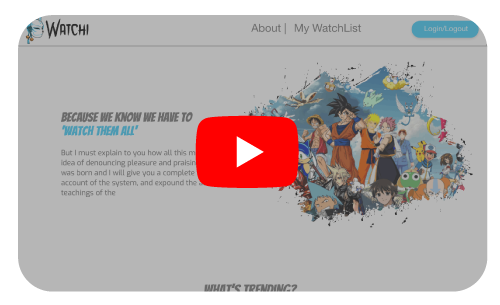
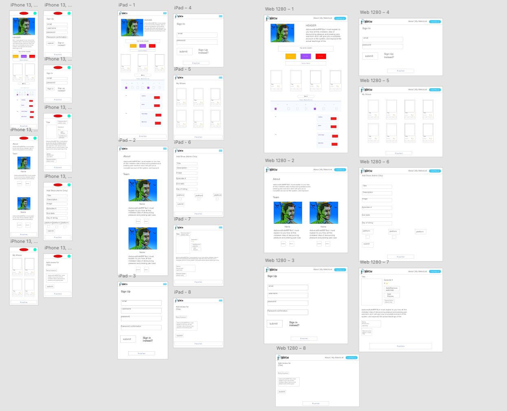
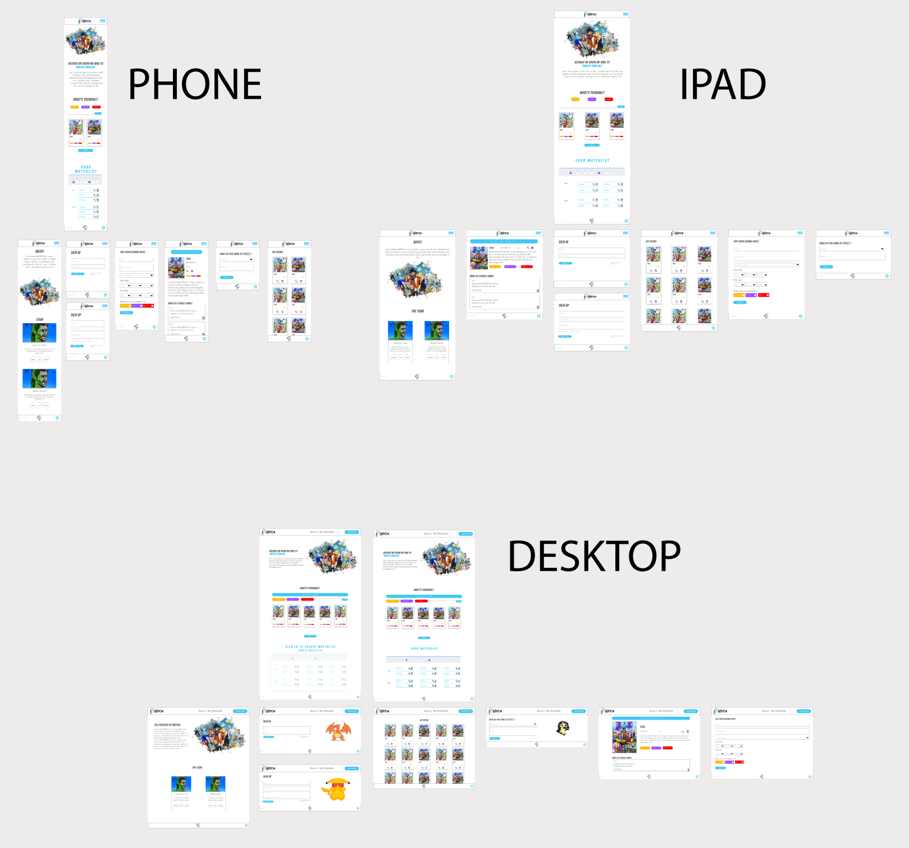
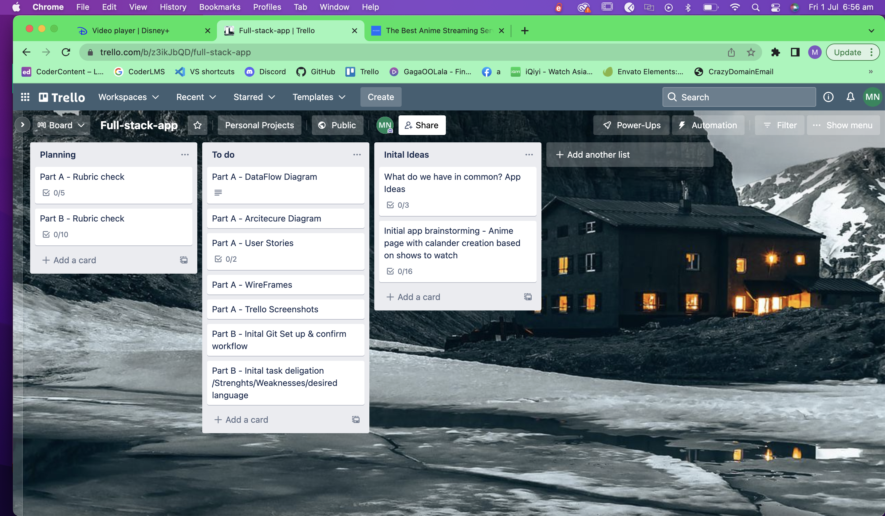

# App title 

## When you miss your favourite show and everyone spoilers it!

This app is designed for the Hardcore Anime lovers, the ones who have 'seen it all' and are 'not so patiently' waiting for the next eps to come out. This platform helps with tracking when thier faviourite shows are being released so they never miss an ep and have upcoming shows scheduled on thier 'my weekly watchlist' 

This will allow users to look through mulitple platforms of shows and filter through each to see what they would like to watch depending on the platform they have a a subscription to. 

This centralises this decision, so people do not have to search through each platform individually for what to watch. 

## Functionality / features
This application pulls data on shows from an API which details all the shows and their upcoming release days and lets the user add these to thier watchlist, which will then present a calander for the user to schedule to watch this episode. 

If a shows airdate is finished it will drop off their calander but still be available to search and see the rating & reviews of the show.  

Users will be able to have a single sign up option through Google. 

## Target audience

## Tech stack
API - Ruby on Rails and Front End - HTML, CSS, React

## ERD

## Dataflow Diagram

## Application Architecture Diagram

## User Stories

|User Role     | Action/Goal                                                  |Value                                 | Acceptance criteria|
|------------|----------------------------------------------------------------|--------------------------------------|--------------------|
| As a Guest | I want to access and navigate the website                      |so I can understand the purpose of the website                                                                  |1.See non-logged in user functionality e.g sign-up / Log-in See
| As a Guest | I want to see all shows                                        |so that I can know what are the most popular anime's currently airing                                           |1.Navigate to the show pages on main page and view top 10 current shows
| As a Guest | I want to filter shows by platform                             |so if I only have access to a certain subscription, I am only seeing that subscription shows                    |1. Ability to click on a susbcription service and see rerendered shows
| As a Guest | I want to sign-up with google or my personal details           |so I can access the add to watchlist feature and so I can have the option to save time and not have to remember login details | 1. Ability to click sign-up button 2. Be directed to sign-up page option 3. Process account sign-up through google account 4. Be logged in with google account
| As a Guest | I want to see show reviews and comments                        |so I can see what other people think of a show and decide if I should watch it                                  | 1. Ability to click on a show and be taken to that shows dedicated page with reviews.
| As a Guest | I want to see add to watch list button to be redirected to sign-up page | so that I understand how the platform works and the features available to me if I sign-up             | 1. Ability to click on button and see a popup or redirect to sign-up page. 
| As a Guest | I want to access an about page                                 | so I understand how the platform work and the features available to me | 1. Ability to click on about page and be re-directed to page. 
| As a User  | I want to do everything a guest can do                         | so I have standard functionality | 1. Same as Guest
| As a User  | I want to add a review to a show with option comment section   | so I can be involved in the Anime community and let other know my opinion on a show without feeling like I am forced to write a full comment | 1. Ability to navigate to shows individual page and click on add review button 2. Ability to see my review after posting
| As a User  | I want to add & remove shows to my watchlist for upcoming and currently airing shows | so I can login each day and see what is available to watch |1. Show appears in my watchlist after selecting it
| As a User  | I want to set a username                                       | so my personal information is protected | 1. See my username displayed in the navbar and when I post a review
| As a User  | I want to logout                                               | so my account information is protected | 1. Ability to click a logout button and be redirected to main page
| As a User  | I want to delete my account                                    | so I have a choice in weather the application keeps my data or if I want to use the platform | 1.Ability to access account details and select delete account 2. Notice after to inform me that my account has been deleted
| As a Admin | I want to do everything a User can do                          | so I can use the site as a user as well as an Admin | Same as User
| As a Admin | I want to delete reviews                                       | so I can regulate the site and ensure there are no in-approriate comments to maintain community guidelines | 1. Be notified a review has been deleted 2. No longer see this review in the shows review page
| As a Admin | I want to Add users and Remove Users and Edit users            | so I can troubleshoot and support new users with their accounts or remove users who go against community guidelines | 1. See all user data and have options to create, edit and delete. 
| As a Admin | I want to Add shows to API via form                            | so I can maintain the database and keep the platform up to date with ongoing shows | 1. See new show added to shows list and be able to search for show after adding it

## Wireframes

### Short video capture of flows (User/Guest view adjusts if logged in)

### Initial Low-Res [Full-exported-artboards](docs/Low-res-wireframes)

#### After inital meeting with the client and gathering initial feedback they have requested
- The addition of the ability for a guest to view what a weekly watchlist woud look like so they have an understanding of how the platform works.
- Client requested new fonts that better represent their brand and taget audience - multiple samples of new brand and logo was provided before deciding on a final. 
- The decision to use a single simple colour pallette was decided to ensure that the site was not overwhelming as there would be muliple colours already displayed with the different platform buttons and the shows icons/titlepages. 
- The addition of easier to navigate buttons and the abiliity to easily remove a show from the users watchlist and easily add a recview to be added to all shows on both the homepage and the individuals full watchlist. 
- The overall design elements needed reiview  - the request to adjust all buttons to be rounded and make it clearer any calls to action. 
- Client wanted a clearer idea of the final product - so additional design elements were added including imagery & shading. 
- Ability for admin to delete reviews not included in initial diagrams - this feature is important to monitor reviews

### High-res [Full-exported-artboards](docs/High-res-wireframes)

After second round of reviews it was highlighted that some functionality based off the user stories were not outlined in the Wireframes
- Client requested the ability for user to see their account details and delete their account to allow user autonomy. Additional wirewireframe for account was created and ability to see this in the 
- Ability for Admin to delete accounts to ensure support of users and also remove any malicious accounts.
- Create clear segregation between each section and adjust general spcaing. e.g ensure that the view show section is seperated from the initial   

### High-res (additional missed wireframes)

## Project Management

#### To start our project we first set up standard ruberic requirements in Trello and started basic admin work e.g Github Repo before we brainstormed on some key concepts or interests of both people to determine a product. 

#### After this we spent half a day whiteboarding wireframes and concepts for a minimum viable product and started basic wireframes. Wireframes were done together so everyone understood the final product and agreed on outcomes. 

